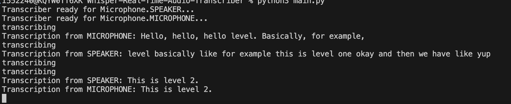

# Whisper Real-Time Audio Transcriber

## Overview

`whisper-real-time-audio-transcriber` is a Python-based tool designed for real-time transcription of audio from multiple sources, including microphones and speakers. It uses advanced libraries and models such as `speech_recognition`, `whisper`, and `blackbox virtual audio` to deliver accurate and efficient audio transcription in parallel.

## Features

- **Real-Time Transcription**: Capture and transcribe audio from multiple microphones and speakers simultaneously.
- **Customizable Models**: Use various models for transcription, including Whisper and others.
- **Flexible Audio Sources**: Supports different audio sources with customizable parameters.
- **Background Processing**: Handles audio processing and transcription in background processes for smooth performance.

## Installation

To get started, clone this repository and install the necessary dependencies:

```bash
git clone https://github.com/yourusername/real-time-audio-transcriber.git
cd real-time-audio-transcriber
pip install -r requirements.txt
brew install portaudio
brew install blackhole-2ch
```

Setup a multi-audio device in the `Audio MIDI setup` of mac and add the speaker source and blackhole 2ch. Make sure to check `drift correction` only for the sources but not for blackhole like the following.


### Dependencies

- `numpy`
- `speech_recognition`
- `openai-whisper`
- `blackbox virtual audio` (to listen to speaker output)
- `multiprocessing`

## Usage

### Running the Transcriber

The repository includes scripts to run the transcriber with specified microphones. Modify the `main.py` script as needed to fit your setup.

1. **Start Transcribers**

    ```bash
    python3 main.py
    ```

    

2. **Customize Microphones**

    Update the `Microphone` enumeration and related code to match your audio hardware setup.

### Configuration

- **Microphone Settings**: Adjust `energy_threshold`, `record_timeout`, and other parameters in the `Transcriber` class constructor.
- **Models**: Choose different models by modifying the `model` parameter in the `Transcriber` class to one of these ['tiny', 'base', 'small', 'medium', 'large'].

## Contributing

Contributions are welcome! Please open an issue or submit a pull request with improvements or bug fixes.

## License

This project is licensed under the MIT License. See the [LICENSE](LICENSE) file for details.

## Contact

For any questions or suggestions, feel free to reach out to [your email or contact info].

---

Thank you for using `whisper-real-time-audio-transcriber`!